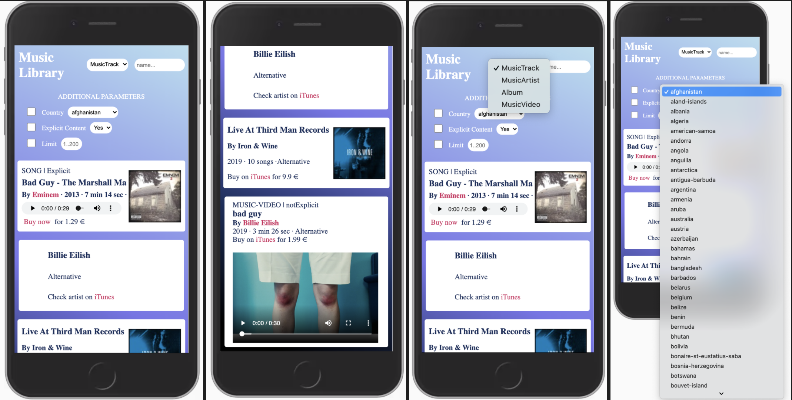

<!-- PROJECT SHIELDS -->
<!--
*** I'm using markdown "reference style" links for readability.
*** Reference links are enclosed in brackets [ ] instead of parentheses ( ).
*** See the bottom of this document for the declaration of the reference variables
*** for contributors-url, forks-url, etc. This is an optional, concise syntax you may use.
*** https://www.markdownguide.org/basic-syntax/#reference-style-links
-->
[![Contributors][contributors-shield]][contributors-url]
[![Forks][forks-shield]][forks-url]
[![Stargazers][stars-shield]][stars-url]
[![Issues][issues-shield]][issues-url]
[![MIT License][license-shield]][license-url]
[![LinkedIn][linkedin-shield]][linkedin-url]

<!-- PROJECT LOGO -->
<br />
<p align="center">
  <a href="https://github.com/victorgreco/music-library">
    
  </a>

  <h3 align="center">Music Library</h3>

  <p align="center">
    A fancy way to find your favorite songs, artists and albums using iTunes API.
    <br />
    <a href="https://github.com/victorgreco/music-library"><strong>Explore the docs »</strong></a>
    <br />
    <br />
    <a href="https://github.com/victorgreco/music-library">View Demo</a>
    ·
    <a href="https://github.com/victorgreco/music-library/issues">Report Bug</a>
    ·
    <a href="https://github.com/victorgreco/music-library/issues">Request Feature</a>
  </p>
</p>

<!-- ABOUT THE PROJECT -->
## About The Project



### Built With

* [ReactJS](https://es.reactjs.org/)
* [Typescript](https://www.typescriptlang.org/docs/)
* [ReactDOM](https://it.reactjs.org/docs/react-dom.html)
* [Axios](https://github.com/axios/axios)
* [Jsonp](https://github.com/axios/axios/blob/master/COOKBOOK.md#jsonp)
* [NodeJS](https://nodejs.org/it/docs/)
* [Jest](https://jestjs.io/)
* [iTunes Store API](https://affiliate.itunes.apple.com/resources/documentation/itunes-store-web-service-search-api/)

<!-- GETTING STARTED -->
## Getting Started

### Prerequisites

This is an example of how to list things you need to use the software and how to install them.
* npm
```sh
npm install npm@latest -g
```

### Installation

1. Clone the music-library
```sh
git clone https://github.com/victorgreco/music-library.git
```
2. Install NPM packages
```sh
npm install
```

3. Run the app
```sh
npm run start
```

4. Run tests in local
```sh
npm run test
```

<!-- ROADMAP -->
## Roadmap

See the [open issues](https://github.com/victorgreco/music-library/issues) for a list of proposed features (and known issues).

<!-- CONTRIBUTING -->
## Contributing

Contributions are what make the open source community such an amazing place to be learn, inspire, and create. Any contributions you make are **greatly appreciated**.

1. Fork the Project
2. Create your Feature Branch (`git checkout -b feature/AmazingFeature`)
3. Commit your Changes (`git commit -m 'Add some AmazingFeature'`)
4. Push to the Branch (`git push origin feature/AmazingFeature`)
5. Open a Pull Request

<!-- LICENSE -->
## License

Distributed under the MIT License. See `LICENSE` for more information.

<!-- CONTACT -->
## Contact

Victor Greco - [linkedin](https://www.linkedin.com/in/victor-greco/) - victorgreco263@gmail.com

Project Link: [https://github.com/victorgreco/music-library](https://github.com/victorgreco/music-library)

<!-- MARKDOWN LINKS & IMAGES -->
<!-- https://www.markdownguide.org/basic-syntax/#reference-style-links -->
[contributors-shield]: https://img.shields.io/github/contributors/victorgreco/music-library.svg?style=flat-square
[contributors-url]: https://github.com/victorgreco/music-library/graphs/contributors
[forks-shield]: https://img.shields.io/github/forks/victorgreco/music-library.svg?style=flat-square
[forks-url]: https://github.com/victorgreco/music-library/network/members
[stars-shield]: https://img.shields.io/github/stars/victorgreco/music-library.svg?style=flat-square
[stars-url]: https://github.com/victorgreco/music-library/stargazers
[issues-shield]: https://img.shields.io/github/issues/victorgreco/music-library.svg?style=flat-square
[issues-url]: https://github.com/victorgreco/music-library/issues
[license-shield]: https://img.shields.io/github/license/victorgreco/music-library.svg?style=flat-square
[license-url]: https://github.com/victorgreco/music-library/blob/master/LICENSE.txt
[linkedin-shield]: https://img.shields.io/badge/-LinkedIn-black.svg?style=flat-square&logo=linkedin&colorB=555
[linkedin-url]: https://www.linkedin.com/in/victor-greco/
[product-screenshot]: images/screenshot.png
